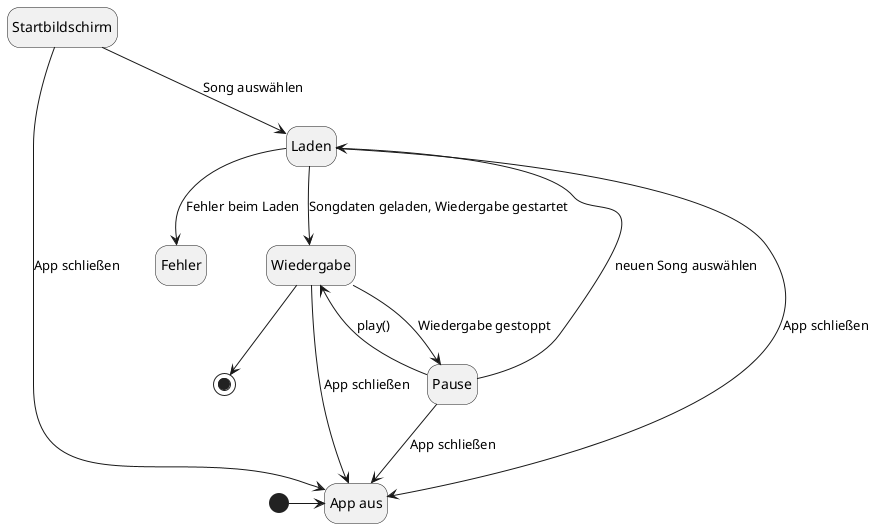

Übung Online-Music-Player

```plantuml
@startuml

hide empty description

state "App aus" as Aus
[*] -> Aus

state "Startbildschirm" as Bereit
state "Laden" as Store
state "Fehler" as Error
state "Wiedergabe" as Playing
state "Pause" as Pause

Bereit --> Store : Song auswählen
Store --> Error : Fehler beim Laden
Store --> Playing : Songdaten geladen, Wiedergabe gestartet
Playing --> Pause : Wiedergabe gestoppt
Pause --> Playing : play()
Pause --> Store : neuen Song auswählen

Bereit --> Aus : App schließen
Store --> Aus : App schließen
Playing --> Aus : App schließen
Pause --> Aus : App schließen

Playing --> [*]

@enduml
```

